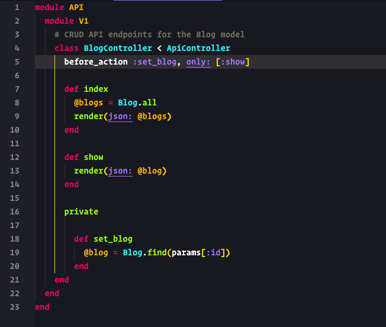

# Monokai Nicbet Theme for Visual Studio Code

This theme has been developed while using it with Ruby on Rails, JavaScript ES6, and SASS.

## Screenshot


Please note that screenshot is taken while using these settings:

```
  "editor.renderWhitespace": "selection",
  "editor.fontFamily": "Operator Mono",
  "editor.fontSize": 15
```

## Features

That's the list of things I wanted to focus on while developing my version of Monokai:

- Distinguish between keywords, methods, and Parameters
- Easily distinguish hash keys vs. symbols
- Comments must fade into background while still being readable
- During a search, the highlighted matches must be _really_ highlighted
- Colors should use a known palette (Monokai)

## Installation

### Cloning the Repository

Change to your Visual Studio Code extensions directory:

```bash
# Windows
$ cd %USERPROFILE%\.vscode\extensions

# Linux & macOS
$ cd ~/.vscode/extensions/
```

Clone repository as `monokai-nicbet`:

```bash
$ git clone https://github.com/nicbet/vscode-monokai-nicbet nicbet.monokai-nicbet-0.1.0
```

Now you can select this theme from the Theme selector in VSCode

## License

This work is licensed under the MIT license
